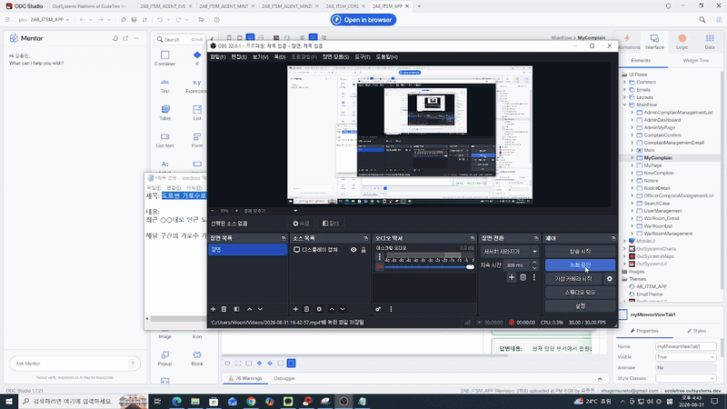

# 🏛️ 민원 처리 지원 AI 플랫폼 (ITSM)

> Agentic AI 기반 지자체 민원 분류·배정·해결방안 추천 시스템
> **팀명: 오인삼종** | OutSystems Developer Cloud(ODC) 기반 구축

[]()
[]()
[]()

---

## 📋 프로젝트 개요

지자체 민원의 **접수 → 분석 → 배정 → 처리 → 완료** 전 과정을 하나의 흐름으로 연결한 민원 관리(ITSM) 플랫폼입니다.
규칙 기반 AI 판정과 생성형 AI 답변 추천을 결합해, 민원 분류·부서 배정·중요도 산정·해결방안 도출을 자동화했습니다.

### 서비스 흐름

```
민원 등록 → AI(민트) 분석 및 부서 추천 → 관리자 검토(승인/보류)
→ AI(민지) 해결방안 추천 → 담당자 처리 및 완료
```

### 주요 사용자

- **민원인** — 민원 신청, 처리 현황 조회
- **민원 처리 담당자** — 배정 민원 처리, AI 추천 답변 기반 회신 작성
- **관리자** — 민원 분류·배정 검토, 대시보드 모니터링, 사용자 관리

---

## ✨ 핵심 기능

- **AI 민원 자동 분류 및 부서 추천** — 민원 유형 5종, 담당 부서 5종 자동 판정
- **악성 민원 판별** — 욕설·협박·도배성 민원 자동 표시 (반려는 관리자 최종 결정)
- **중요도 등급 및 SLA 자동 산정** — 긴급도·영향도 채점 기반 4단계 등급, 등급별 처리기한 자동 계산
- **과거 사례 기반 해결방안 추천** — 벡터 검색(RAG)으로 유사 민원 사례를 찾아 답변 초안 생성
- **부서 간 협업 워룸(War Room)** — 다부서 복합 민원의 이관·논의·최종 답변 통합
- **알림 시스템** — 담당자 배정, SLA 마감 임박, 지연 위험, SLA 위반 알림
- **관리자 대시보드** — 민원 처리 현황 및 통계 조회
- **공지사항 · FAQ · 마이페이지** 등 대민 서비스 기능

---

## 🤖 AI 에이전트 구성

역할이 분리된 3개의 AI 에이전트로 구성됩니다.
**AI는 판단만 담당**하고, 등급 산정·SLA 계산 같은 규칙 연산은 서버 로직이 전담하도록 설계했습니다.

### 1. 민트 (Mint) — 민원 분석·악성 판별 에이전트

- **방식**: 경량 언어 모델(Gemini) + 고정 판단 기준 문서(Knowledge) 기반 규칙 매칭
- **역할**: 민원 유형 분류, 담당부서 추천, 긴급도·영향도 채점, 악성 여부 판별, 판단 사유 작성
- **기준값**

| 구분 | 값 |
|---|---|
| 민원 유형 | 고충민원 / 건의 / 단순질의 / 법령질의 / 신고 |
| 담당 부서 | 도시교통부 / 안전건설부 / 주민복지부 / 행정경제부 / 환경녹지부 |
| 중요도 등급 | 긴급 / 높음 / 보통 / 낮음 |
| SLA(처리기한) | 긴급 1일 · 높음 3일 · 보통 7일 · 낮음 14일 |




### 2. 민지 (Minzi) — 민원 처리 지원 에이전트

- **방식**: 생성형 + 검색형 융합(복합 RAG), 추론 모델 사용
- **역할**: 과거 유사 민원 사례를 벡터 검색해 근거로 삼고 답변 초안 생성 (환각 방지)
- **데이터**: 초기 충남 민원 데이터 582건 + 매일 자정 배치로 전일 종료 건 자동 벡터화 추가
- **설계 원칙**: 민트의 판정 결과(등급·부서·점수·SLA)는 참조만 하고 재계산하지 않음

### 3. 이브 (EVE) — 부서 간 협업 지원 AI 비서

- **역할**: 워룸 개설, 부서 이관, 대화 내용 요약, 시민 제출용 최종 답변 통합
- **부가 기능**: 공지사항 등록, 긴급 민원 알림 발송, 우선 처리 민원 조회, 신규 사원 등록 및 권한 부여

---

## 🛠️ 기술 스택

| 구분 | 사용 기술 |
|---|---|
| 플랫폼 | OutSystems Developer Cloud (ODC) — Reactive Web |
| AI 모델 | Google Gemini (REST 연동) |
| 인증 | ODC Auth Engine |
| 데이터 | ODC 엔티티, Static Entity(코드값), 벡터 스토어(RAG) |
| 아키텍처 | Data / Logic / UI 레이어 분리 |

---

## 🖥️ 화면 구성

| ID | 화면명 |
|---|---|
| SCR-MAIN-01 | 메인 |
| SCR-NEW-01 | 민원 신청 |
| SCR-MY-01 | 내 민원 조회 |
| SCR-NOT-01 / SCR-NOT-02 | 공지사항 목록 / 상세 |
| SCR-MP-01 / SCR-AMY-01 | 마이페이지 / 관리자 마이페이지 |
| SCR-AMAIN-01 | 관리자 대시보드 |
| SCR-CPL-01 / 02 / 03 | 민원 관리 목록 / 상세 / 담당자별 목록 |
| SCR-USG-01 | 사용자(사원) 관리 |
| SCR-CPF-01 | 민원 확정 |
| SCR-SearchCase-01 | 유사 사례 검색 |
| SCR-WRM-01 / 02 / 03 | 워룸 목록 / 상세 / 관리 |

---

## 🗂️ 데이터 모델

`Complaint`(민원)를 중심으로 다음 엔티티가 연결됩니다.

- **민원 처리**: `Complaint` ─ `Assessment`(1:N, AI 평가) ─ `Reply`(1:1, 답변)
- **기준 정보(Static)**: `Category` · `Department` · `Status` · `Grade` · `RoleType` · `WarnType` · `SlaPolicy`
- **부서 협업**: `WarRoom` ─ `WarRoomParticipant` ─ `WarRoomMessage`
- **사용자·알림**: `UserExtension` · `WarnAdmin` · `WarnCitizen`

N:M 관계는 Junction Entity로 구현했으며, 외래키 삭제 규칙은 Delete Rule에 따릅니다.

---

## 👥 팀 구성 (오인삼종)

| 역할 | 담당자 | 주요 업무 |
|---|---|---|
| PL · 아키텍트 | 채종민 | 전체 일정·통합 관리, ERD/아키텍처 총괄 |
| 데이터 담당 | 강종민 | 엔티티 설계, Static·기준정보 세팅, 데이터 Import/Aggregate |
| 화면 담당 | 유종민 | 처리 큐·상세·등록·대시보드 등 Reactive Web UI |
| AI 담당 | 공현진 | 판정 서버 액션(규칙 엔진) + Gemini REST 연동 (민트·민지 에이전트) |
| QA 담당 | 허성무 | 기능 검증, 문서 간 정합성 점검 |

---

## 📁 산출물 문서

| No. | 문서 | 내용 |
|---|---|---|
| 01 | 프로젝트 기획서 | Project Charter |
| 02 | 요구사항 정의서 | Requirements |
| 03 | 기능 정의서 | Functions |
| 04 | 화면 정의서 | Screen Definition |
| 05 | 데이터 모델 정의서 | Data Model / ERD |
| 06 | AI Agent 설계서 | 민트 · 민지 · 이브 |
| 07 | 구현 점검 리뷰 | Implementation Review |
| 08 | Mentor 활용 로그 | Mentor Log |
| 09 | 테스트 시나리오 | Test Scenario (TC 53건) |

---

## 📄 라이선스

본 프로젝트는 OutSystems Academy 팀 프로젝트 산출물입니다.
